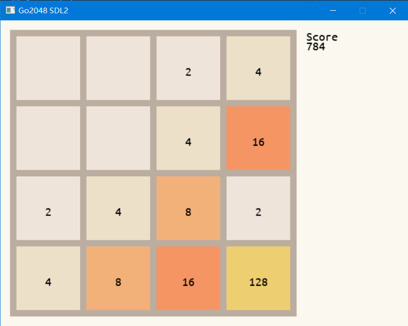

# Go2048
Yet another 2048 game implemented in golang with [go-sdl2](https://github.com/veandco/go-sdl2).

---

## Screenshots


## Build
Install [go-sdl2](https://github.com/veandco/go-sdl2). After that simply type
```
go build main.go
```
and you'll get your game binary.

---

2020, net2cn, proudly coded in boring classes.